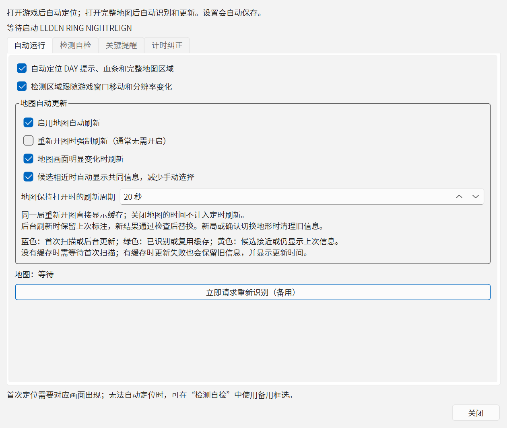
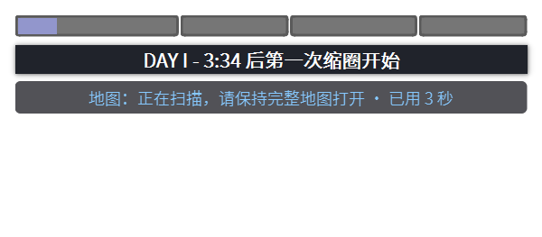
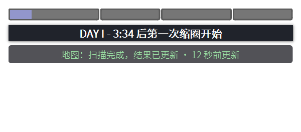
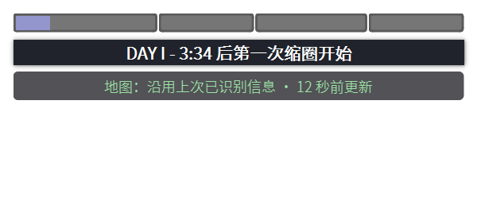
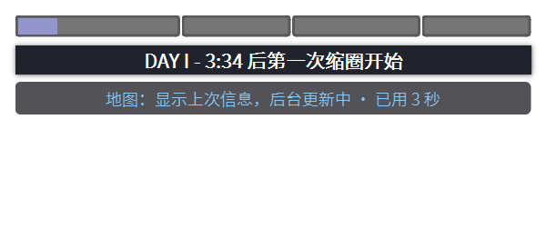
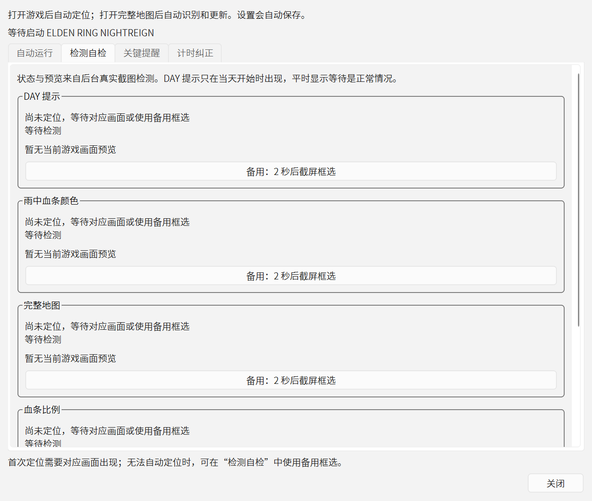
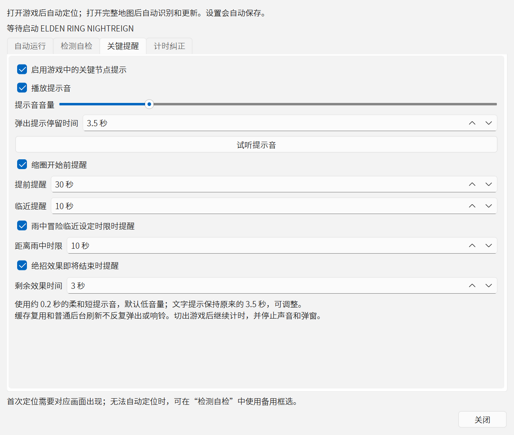
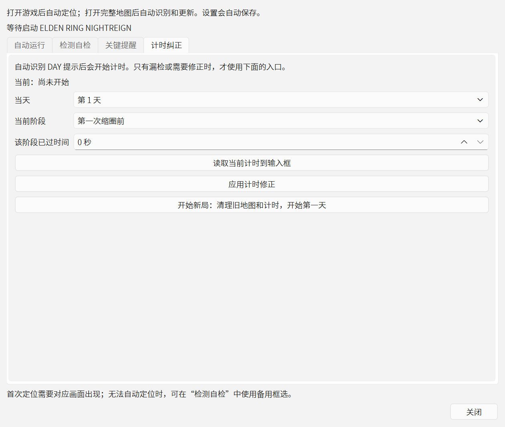

# 黑夜君临地图信息助手：图文使用指南

适用于 `0.10.6+auto.3`（r3）。通常只需启动助手并正常开图，无需手动截图或每次点击识别。首次扫描用状态文字判断是否结束，不承诺固定几秒内完成。

本文设置截图来自当前 r3 实际界面，截取时未连接游戏。悬浮状态、地图标注和弹窗截图使用受控示例数据，均为演示，不是实战识别或准确率证明。

## 1. 下载与启动

1. [下载完整 Windows 程序包](https://github.com/Gywikun/nightreign-overlay-helper-plus/releases/download/v0.10.6-auto.3/nightreign-helper-auto-0.10.6-r3-win64.zip)。当前版本是预发布版。
2. 使用“全部解压”，进入解压后的程序目录；不要在压缩包预览里直接运行。
3. 确认 `NightreignHelper-Auto-r3.exe` 与 `_internal` 文件夹在同一目录，再双击 EXE。
4. 程序包已包含运行库，普通使用者无需安装 Python。游戏使用窗口化或无边框窗口化。

| Release 附件 | 用途 |
|---|---|
| `nightreign-helper-auto-0.10.6-r3-win64.zip` | 首次使用下载这个完整包 |
| `NightreignHelper-Auto-r3.exe` | 仅给已有同版本 `_internal` 运行库的用户，不可单独运行 |
| `nightreign-helper-auto-0.10.6-r3-source.zip` | 对应发布版本的开发源码，不是 Windows 启动程序 |
| `SHA256SUMS-r3.txt` | 核对程序包、源码包和 EXE 的下载完整性 |

需要查源码时可使用固定的[发布标签](https://github.com/Gywikun/nightreign-overlay-helper-plus/tree/v0.10.6-auto.3)，当前默认分支可能包含后续文档更新。

## 2. 首次设置：保留默认自动功能

首次启动会同时打开主“设置”和“自动运行、检测自检与计时纠正”窗口。日常主要使用后者的四个标签页。

在“自动运行”页确认默认设置：

- 勾选“自动定位 DAY 提示、血条和完整地图区域”。
- 勾选“检测区域跟随游戏窗口移动和分辨率变化”。
- 勾选“启用地图自动刷新”，刷新周期默认 `20 秒`。
- “重新开图时强制刷新（通常无需开启）”保持关闭，方便同一局复用缓存。

主设置里的“启用地图识别”是地图识别总开关，默认开启。“启用地图自动刷新”控制自动刷新策略；关掉它不等于关闭所有地图识别，开局和手动请求仍可能触发识别。

关闭两个设置窗口，切回游戏。设置关闭后程序仍在运行：可右键 Windows 托盘图标（可能在任务栏隐藏图标里），选择“自动运行与检测自检”再次打开；也可右键悬浮计时器打开菜单。

自动增强设置修改后自动保存；主设置关闭时保存。需要结束程序时，使用托盘菜单“退出”。

## 3. 开局与首次地图扫描

1. 尽量在开局前启动助手，让游戏里的 DAY 提示正常出现。连续检测到提示后会开始计时，同一个提示持续显示不会反复重置。
2. 在游戏内打开完整地图，缩放到最小，让地图边框完整可见，保持游戏在前台。
3. 灰色等待表示正在等待完整画面、画面稳定或扫描间隔；蓝色“正在扫描”表示本次识别还没结束。
4. 等到绿色“扫描完成，结果已更新”，或黄色“候选接近，显示共同信息”后，再关闭地图继续游戏。候选接近仅显示共同信息，不同预测会省略。

**扫描状态演示：计时和已用秒数为示例值。**

**完成状态演示：不是实战结果。**

首次无缓存时，关图、放大到局部地图、切出游戏或明显改变画面，都可能让本次结果无法采用。扫描超过 `15 秒` 的结果也不采用，失败后等待至少 `5 秒` 再重试。请根据当前状态处理，不把“等了几秒”当成扫描成功。

## 4. 再次开图、后台刷新与状态含义

同一局再次开图先显示已识别缓存。默认不会因为重新开图就强制重扫，也不会重复播放缓存提示音。持续保持地图打开到刷新周期、画面明显变化、第二天计时开始或人工请求等情况，会请求更新；关闭地图的时间不计入开图刷新周期。

后台刷新期间保留原标注，新结果通过检查后才替换。更新时间越久，越需要核对它是否仍适用于当前游戏画面。新局、确认不同地形或退出程序后，不继续沿用这份缓存。

| 颜色与状态 | 当前信息 | 建议操作 |
|---|---|---|
| 灰色：等待、未显示完整地图 | 尚未获得可展示的本次结果 | 展示完整地图、缩到最小并保持游戏前台；若长期等待，查看自检 |
| 蓝色：正在扫描 | 本次首次扫描还没有完成 | 保持完整地图打开，等完成或失败文字 |
| 蓝色：显示上次信息，后台更新中 | 屏幕标注仍来自上次结果 | 可以看旧信息；等更新结束后核对更新时间 |
| 绿色：扫描完成，结果已更新 | 本次生成了可用标注并通过当前检查 | 可继续游戏；预测仍需自行核对 |
| 绿色：沿用上次已识别信息 | 同一局缓存，未因本次开图重新识别 | 正常使用，留意“几秒前更新” |
| 黄色：候选接近，显示共同信息 | 相近候选共有的内容 | 把它当参考，不把省略的预测自行补成确定结果 |
| 黄色：本次更新未采用，保留上次信息 | 本次更新失败，正在显示旧缓存 | 核对更新时间；保持完整画面等重试，必要时请求重新识别 |
| 黄色：关图或缩放过早等中断 | 本次结果未采用 | 回到完整地图后重试 |
| 红色：画面匹配不足、未显示预测 | 没有本次可用标注 | 检查前台、缩放和检测区域；看[常见问题](常见问题.md) |

**缓存与后台刷新状态演示：**

如确需重扫，“自动运行”页点击“立即请求重新识别（备用）”，然后切回游戏完整地图。按钮提交的是请求，仍需满足前台、完整地图、画面稳定和最小扫描间隔，点击不等于已识别完成。

## 5. 自动定位失败：检查与备用校准

1. 右键托盘 → “自动运行与检测自检” → “检测自检”。
2. 看窗口提示是否找到了 `ELDEN RING NIGHTREIGN`；检查“完整地图”模块的定位状态和当前区域预览。
3. DAY 提示平时不出现，自检里的 DAY 等待属于正常情况；切出游戏后没有新的画面预览，也不一定是故障。
4. 长期无法自动定位地图时，在“完整地图”模块点“备用：2 秒后截屏框选”。在 2 秒内切回游戏并打开完整地图。
5. 在截图框选界面按提示选择地图区域，使框边和完整地图边框贴合，点击“保存”；回到游戏检查状态。校准信息会保存。

自检页可以滚动，底部还有血条比例和绝招图标模块。DAY 和雨中血条颜色使用同一备用框选入口，按截屏界面的标注提示操作。

特殊界面比例、HDR、低血量等情况仍可能需要一次校准；不能据此保证所有游戏设置都可自动识别。

## 6. 提示音、文字提示与计时纠正

“关键提醒”页可以关闭“播放提示音”、调整“提示音音量”，或点击“试听提示音”。声音约 `0.2 秒`，默认音量 `20`；“弹出提示停留时间”只改变文字停留时长，默认 `3.5 秒`，可调 `0.5～5 秒`。

缩圈提醒默认提前 30/10 秒，雨中设定时限前 10 秒，绝招效果结束前 3 秒。缓存复用和普通后台更新不会反复弹出、响铃。切出游戏后继续计时，停止触发新的游戏提醒；已经出现的提示按设定时长结束。

**地图完成弹窗演示：非实战结果。**

如果错过开局 DAY 提示，进入“计时纠正”，选择实际当天、当前阶段，填写**该阶段已过时间**，点击“应用计时修正”。不要把整局累计时间填成阶段时间。

如果确认已经开始新的一局，可用“开始新局：清理旧地图和计时，开始第一天”。该按钮会清理旧信息并开始第一天，应在真实新局使用。

## 7. 快捷键与其他功能

快捷键默认未绑定。需要时在主设置中点击对应“未设置”按钮，按界面提示绑定键盘或手柄组合键；指南不指定固定 F 键。

绝招倒计时沿用原版，需要首次框选自己的绝招图标，并绑定游戏里实际使用的绝招键。当前支持女爵、隐士、执行者、复仇者、学者。

主设置“游戏语言”要和游戏实际语言一致。地图局部缩放跟踪、路线规划和队友共享尚未实现；当前自动更新的是截图识别结果，地图数据仍来自 v0.10.5，不是在线更新游戏数据库。

## 8. 反馈问题

先查看[常见问题](常见问题.md)。仍无法解决时，打开[问题反馈入口](https://github.com/Gywikun/nightreign-overlay-helper-plus/issues/new/choose)，提供版本、Windows 版本、分辨率/显示缩放、窗口模式、游戏语言、HDR、复现步骤、期望与实际结果。

截图优先包含悬浮状态文字和“检测自检”对应区域；日志可从主设置“打开日志位置”取得。截图/日志由你确认后自行附在 Issue 中，不会由本指南自动提交。

返回[仓库首页](../README.md) · [全部界面截图](界面截图.md)
