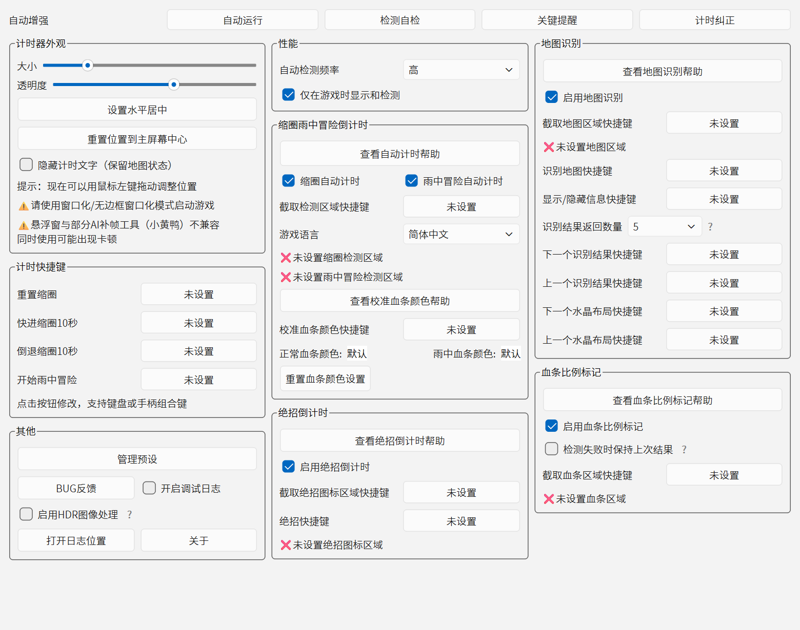
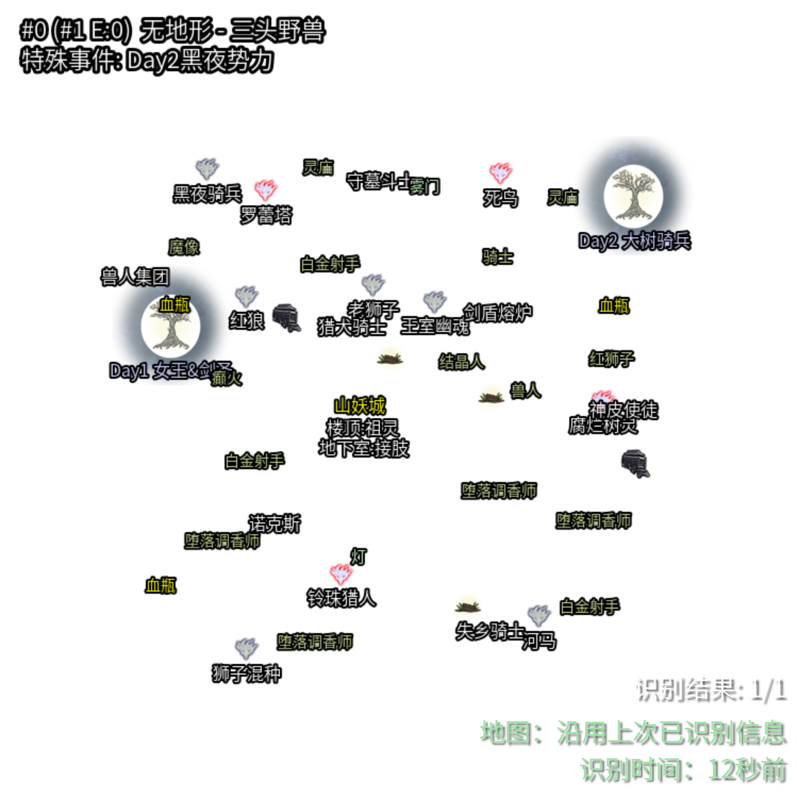
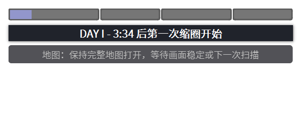
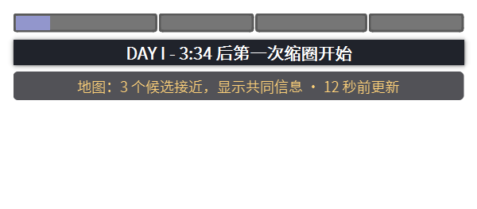
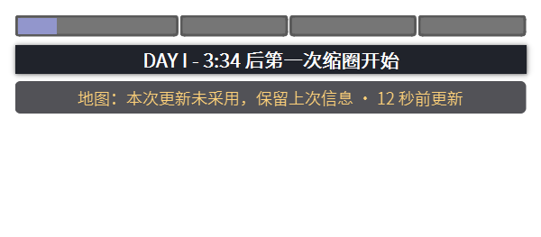
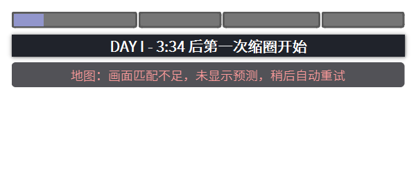
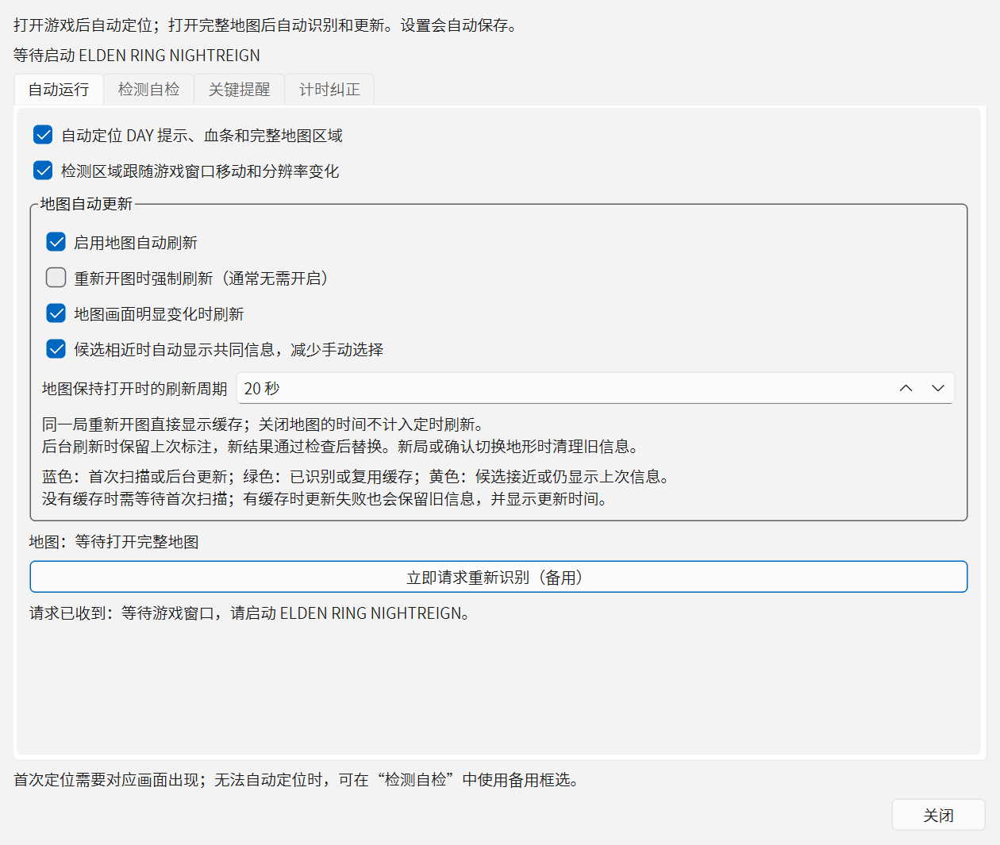
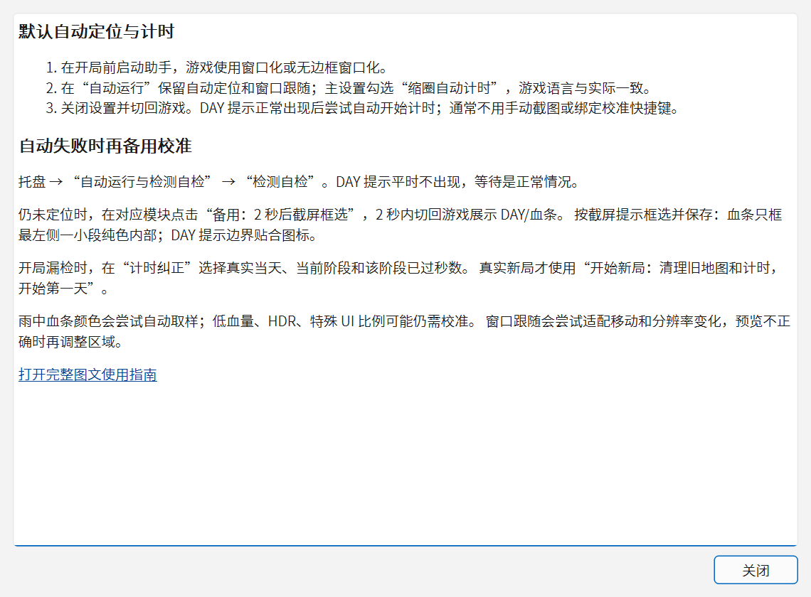
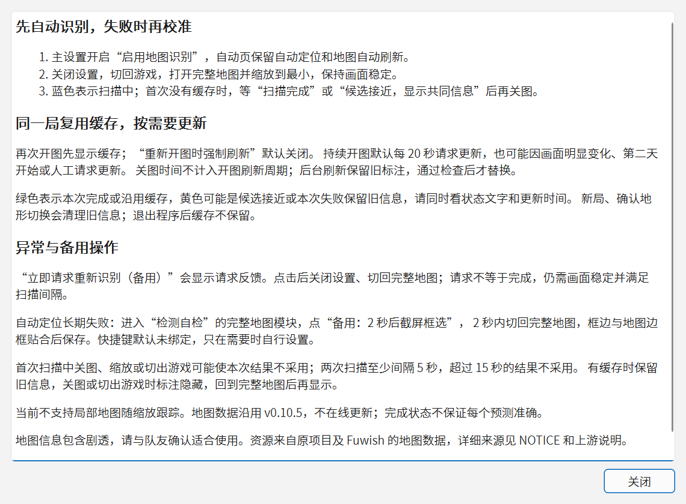

# 界面与状态截图

截图日期：2026-10-02；版本：`0.10.6+auto.3`（r3）。所有图片均由当前程序真实 Qt 控件重新截取，未截取用户桌面。

**01～05 是未连接游戏时的实际设置界面；06～15 是受控状态演示，计时、更新时间、候选与标注均为示例输入，非实战截图。** 标注素材沿用上游资源，来源见 [NOTICE](../NOTICE.md)。黑色/透明背景是助手自身的标注层，不是游戏地图缺失或实战识别效果。

## 01. 自动运行：日常默认设置

重新开图强制刷新默认关闭，持续开图刷新周期默认 20 秒。首次使用一般保留默认值。

## 02. 检测自检：找原因与备用框选

未连接游戏，因此显示等待和无预览。完整地图模块的备用按钮可在 2 秒后截屏框选；页面下部还有其他模块，需要滚动查看。

## 03. 关键提醒：声音与文字时长

文字停留时间不改变声音长度。默认音量 20，文字 3.5 秒。

## 04. 计时纠正：漏检后恢复

填写的是当前阶段已过秒数。新局按钮会清理旧信息并开始第一天，应在确实进入新局时使用。

## 05. 主设置：总开关、快捷键与其他功能

截图使用较宽窗口，展示地图识别总开关、语言、备用快捷键和日志入口。快捷键未绑定、区域未定位时的红叉，是这里的首次空状态，不表示已扫描失败。

## 06. 地图标注层演示（非实战）

使用随程序提供的一份布局数据调用实际标注绘制代码，展示地点文字、图标、候选序号与右下角更新时间。没有叠加真实游戏地图，没有进行游戏截图匹配。

## 07～14. 悬浮状态演示（非实战）

这些截图的 DAY 倒计时、扫描用时、更新时间和候选数量均是示例值。程序实际运行时由当前扫描状态生成，不能根据示例秒数估计自己的扫描耗时。

### 07. 等待：显示完整地图并等待稳定

### 08. 扫描中：保持完整地图打开

### 09. 本次完成：通过当前检查

### 10. 缓存复用：留意上次更新时间

### 11. 后台刷新：当前标注仍是旧信息

### 12. 候选接近：只显示共同内容

### 13. 本次更新未采用：保留旧缓存

### 14. 匹配不足：没有本次可用预测

## 15. 完成弹窗演示（非实战）

首次地图扫描的提示示例。缓存复用和普通后台刷新不会重复弹出；声音未包含在截图中。

真实操作顺序与恢复步骤见[图文使用指南](使用指南.md)和[常见问题](常见问题.md)。

## r4 新增界面（2026-10-03，实际界面，未连接游戏）

### 16. 刷新请求与等待原因

### 17. 当前自动计时帮助

### 18. 当前地图帮助

帮助内容可滚动，底部提供完整图文指南链接。

